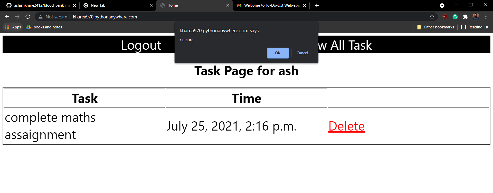

# To_do_Web_Application
A Django based to-do-list web application with email authentication , django rest framework, and hosting on python anywhere.com

# website link
http://kharea970.pythonanywhere.com/usignup/

# Project Title
TO-DO List WebApplication is django based web application whic is basically crude operation also with additional feature like user authorization  using email - verification.

# future work to do
Implementation JWT authentication in the project

# SignUp page

# Email with Password

# Login Page

# view all task

# Create New task

# All Tasks

# Deleting Task

